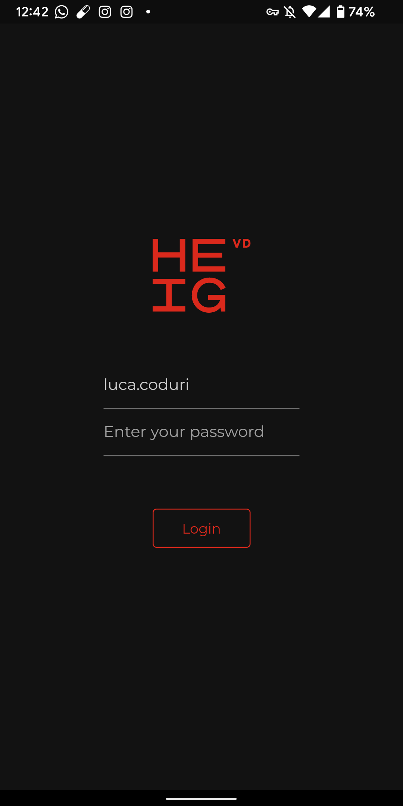
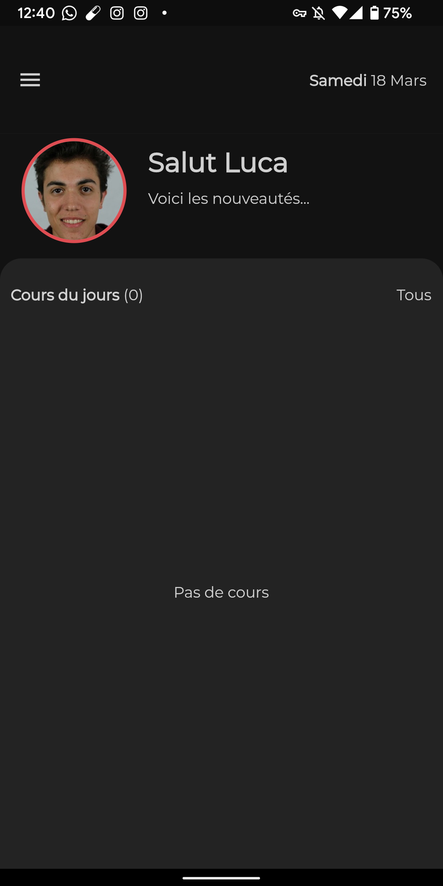
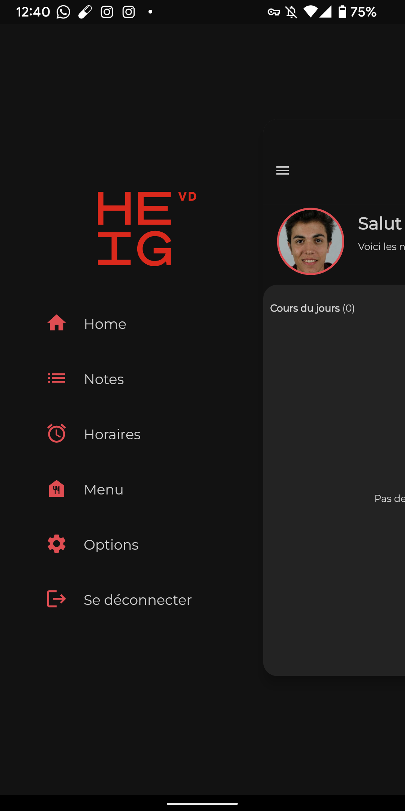
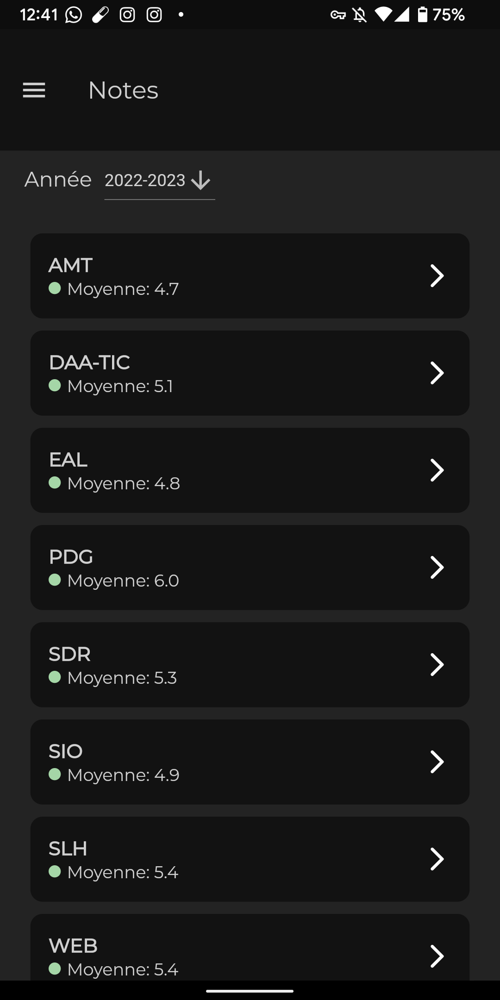
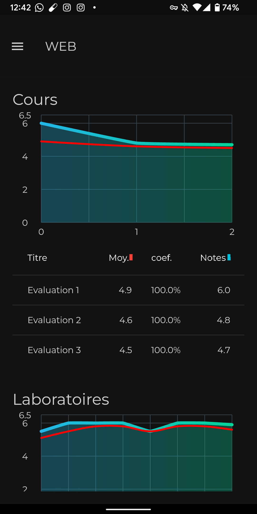
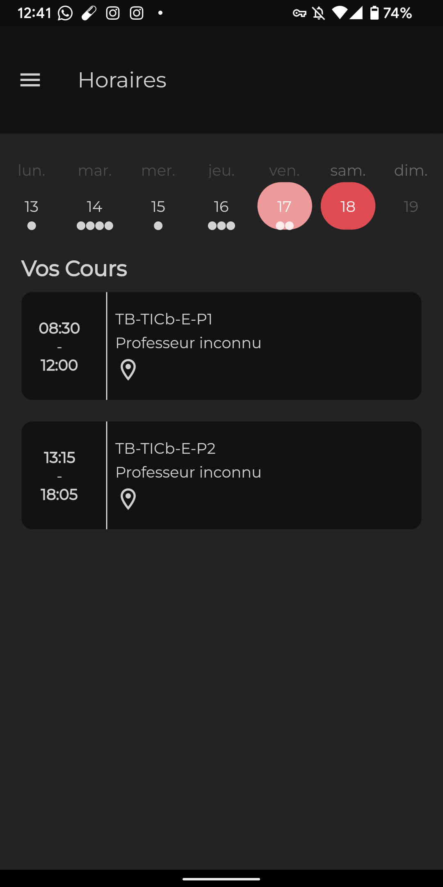
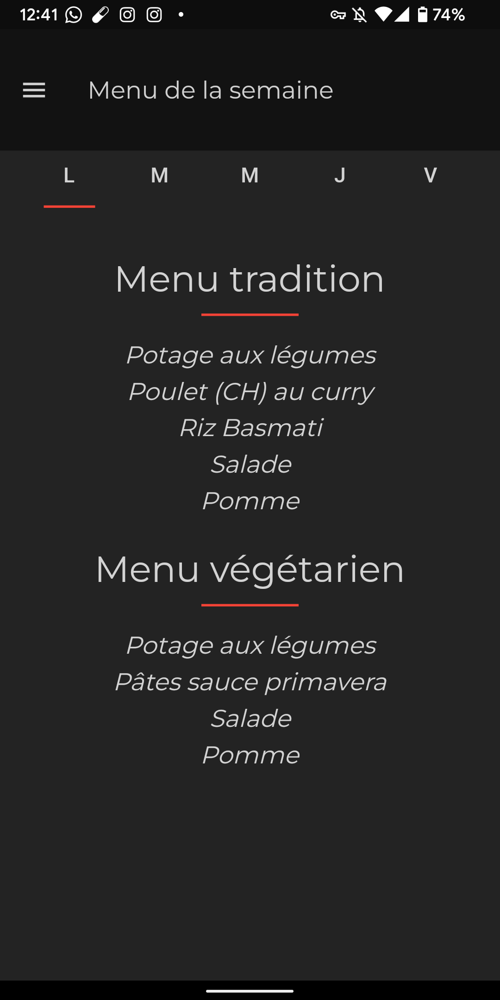

# HEIG Application mobile non officiel

Cette application fonctionne avec l'HEIG-API pour récuperer les informations de gaps.

Elle permet de voir son horaires, d'être notifier 20 minutes avant un cours, de voir ses notes et de voir le menu de la cantine.

Voici à quoi elle ressemble:

|                                    EXAMPLE                                     |                                    EXAMPLE                                     |
| :----------------------------------------------------------------------------: | :----------------------------------------------------------------------------: |
|  |  |
|  |  |
|  |  |
|  |

# ATTENTION LE LOGO NE M'APPARTIENT PAS !
